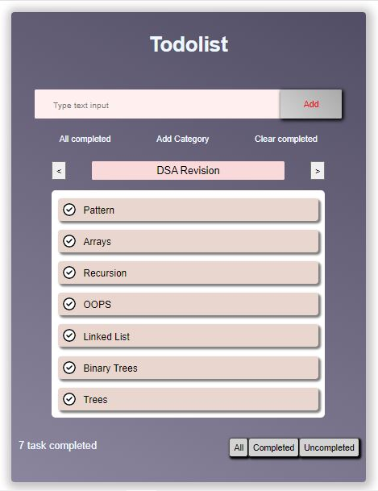

# TodoList Advanced

The Todo list now lets you make your own categories to organize tasks better. You can also quickly manage tasks with new buttons like "Check/Uncheck All" and "Clear". These buttons help you mark tasks or clear the whole list easily, making it simpler to keep track of what's done. These updates make the Todo list easier to use and help you get things done faster.

## Demo

https://www.youtube.com/watch?v=WCBxXNc3n34

## Link

https://symits54321.github.io/Todolist-Advanced/

